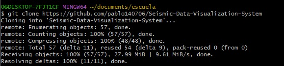
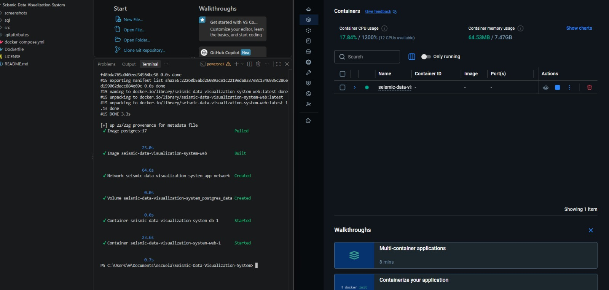
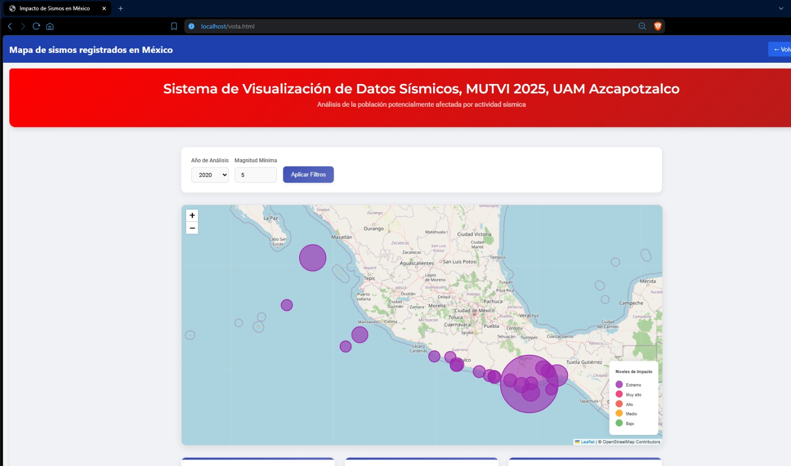
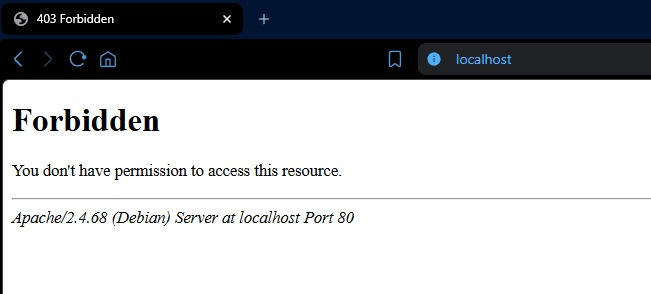
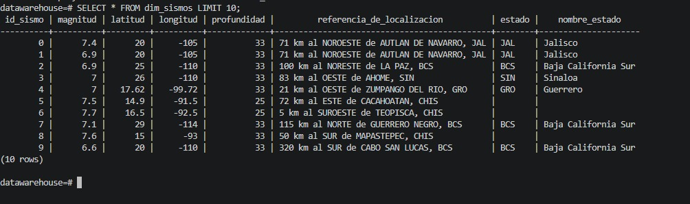

# Levantamiento del proyecto asignado: Sismos

## Datos generales

- **Proyecto asignado:** Sistema de visualización de datos sísmicos de México
- **Repositorio original:** https://github.com/gabrielhuav/Seismic-Data-Visualization-System
- **Fork del equipo:** https://github.com/pablo140706/Seismic-Data-Visualization-System
- **Commit que lo puso en funcionamiento:** *(pendiente — correr `git log -1 --format=%H` dentro de la carpeta del fork y pegar el hash aquí)*

## Requisitos

- Docker Desktop instalado y corriendo, con virtualización habilitada.
- Git.
- Puertos libres en la máquina: `80` (app web) y `5433` (PostgreSQL mapeado desde el `5432` interno del contenedor).
- Navegador web.

Stack del proyecto (según su README): PHP + JavaScript para la app web, PostgreSQL 17 como base de datos, todo orquestado con Docker Compose (`docker-compose.yml`, `Dockerfile`).

## Pasos ejecutados, en orden

1. **Fork del repositorio asignado**
   Se hizo fork de `gabrielhuav/Seismic-Data-Visualization-System` a la cuenta `pablo140706`, por separado del repositorio de equipo Catscoms.

2. **Clonado del fork**
   ```
   git clone https://github.com/pablo140706/Seismic-Data-Visualization-System
   cd Seismic-Data-Visualization-System
   ```

3. **Inspección del contenido**
   ```
   ls
   ```
   Resultado: `Dockerfile`, `LICENSE`, `README.md`, `docker-compose.yml`, `screenshots/`, `sql/`, `src/`.

4. **Levantamiento de contenedores**
   ```
   docker-compose up -d
   ```
   Se levantaron dos contenedores:
   - `seismic-data-visualization-system-web-1` (Apache + PHP), puerto `80:80`.
   - `seismic-data-visualization-system-db-1` (PostgreSQL 17), puerto `5433:5432`.

   Verificado con:
   ```
   docker ps
   ```

5. **Acceso a la aplicación**
   Se navegó a `http://localhost` y luego a las rutas específicas encontradas dentro del contenedor (`http://localhost/vista.html`, `http://localhost/sismos.php`, `http://localhost/datos_sismicos.php`).

6. **Consulta directa a la base de datos**
   ```
   docker exec -it seismic-data-visualization-system-db-1 psql -U postgres -d datawarehouse
   ```
   Dentro de `psql`:
   ```sql
   \dt
   SELECT * FROM dim_sismos LIMIT 10;
   ```
   Se listaron las tablas del esquema (`dim_economia`, `dim_sismos`, `dim_tiempo`, `dim_zonas`, `fact_impacto_sismos_imputed`) y se obtuvo resultado exitoso de la consulta sobre `dim_sismos`.

## Errores encontrados y cómo se resolvieron

### 1. `403 Forbidden` al entrar a `http://localhost`
**Mensaje:**
```
Forbidden
You don't have permission to access this resource.
Apache/2.4.68 (Debian) Server at localhost Port 80
```
**Causa:** el log de Apache mostró `AH01276: Cannot serve directory /var/www/html/: No matching DirectoryIndex (index.php,index.html) found`. El proyecto no tiene un `index.php`/`index.html` en la raíz; sus páginas se llaman `sismos.php`, `vista.html`, `datos_sismicos.php`, etc.
**Solución:** acceder directamente a la ruta correcta, por ejemplo `http://localhost/vista.html`, en vez de `http://localhost/`.

### 2. `Connection refused` al conectar a PostgreSQL (host `db`, puerto `5432`)
**Mensaje:**
```
Warning: pg_connect(): Unable to connect to PostgreSQL server: connection to server at "db" (172.18.0.2), port 5432 failed: Connection refused
```
**Causa:** el contenedor web arrancó y sirvió la primera petición antes de que el contenedor de PostgreSQL terminara de inicializar (estaba corriendo los scripts SQL de carga inicial, visibles en `docker logs seismic-data-visualization-system-db-1` como una serie de `INSERT 0 1`).
**Solución:** esperar a que terminara la inicialización de la base de datos y recargar la página. No fue necesario modificar configuración.

### 3. Error de conexión en `datos_sismicos.php` (host `localhost`, puerto `5432`)
**Mensaje:**
```
Error de conexión: SQLSTATE[08006] [7] connection to server at "localhost" (::1), port 5432 failed: Connection refused
connection to server at "localhost" (127.0.0.1), port 5432 failed: Connection refused
```
**Causa:** bug del proyecto original — ese archivo específico tiene la conexión a la base de datos codificada con el host `localhost` en vez de `db` (el nombre del servicio en `docker-compose.yml`). Dentro de un contenedor, `localhost` apunta al propio contenedor web, no al contenedor de la base de datos, así que nunca puede conectar.
**Estado:** no resuelto — es un error del código fuente del proyecto asignado, no de la configuración del entorno. Queda documentado como hallazgo; puede retomarse en las propuestas de mejora del Ejercicio 6 (por ejemplo, "corregir el host de conexión hardcodeado en `datos_sismicos.php`").

## Evidencia

**Clonado del fork:**



**Construcción y arranque de los contenedores:**



**Aplicación funcionando (`localhost/vista.html`):**



**Error 403 Forbidden al entrar a `localhost/` (ver sección de errores):**



**Consulta directa a la base de datos:**

