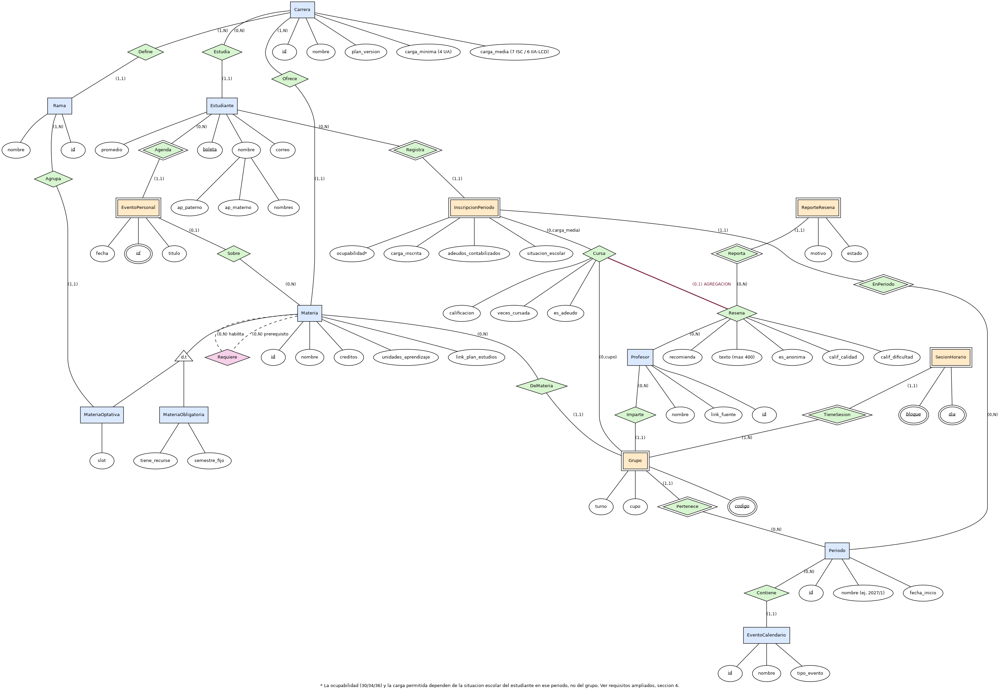
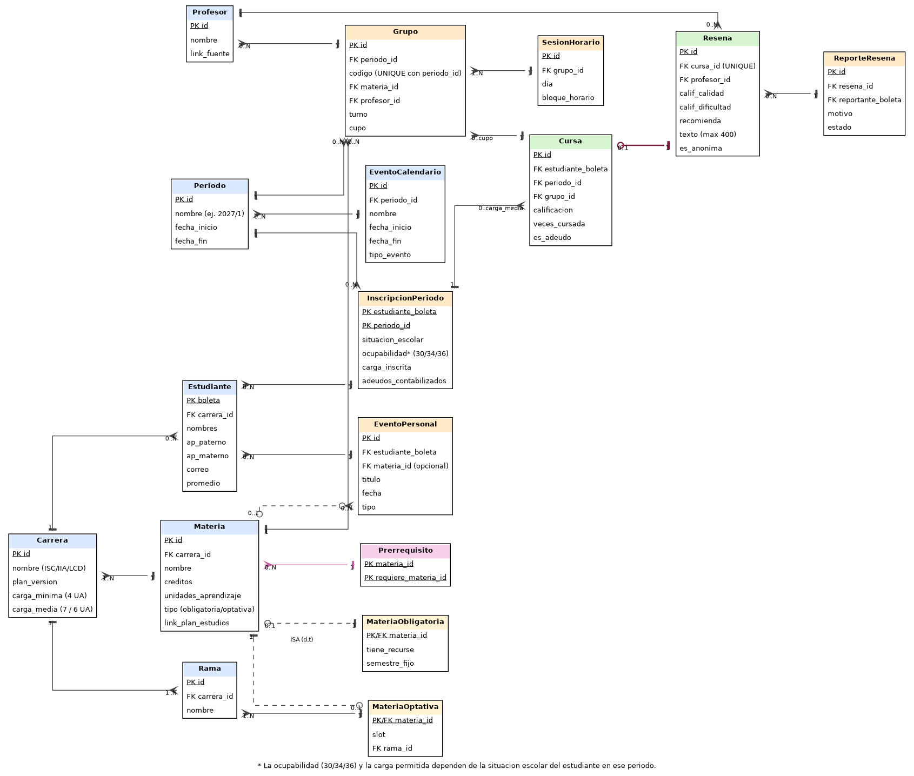

# Ejercicio 4. Modelo EER del proyecto propio

**Gestor académico ESCOM**

| | |
|---|---|
| **Unidad de aprendizaje** | Bases de Datos |
| **Programa académico** | Ingeniería en Sistemas Computacionales / 2020 |
| **Equipo** | Catscoms |

---

## 4.1 Requisitos ampliados

### Problema

Los estudiantes de ESCOM (ISC, IIA y LCD) planean cada reinscripción cruzando a mano información que vive en lugares distintos: el kardex para saber qué reprobaron, el estado del alumno para conocer su situación escolar y cuánta carga les permiten, el módulo de horarios de SAES para ver qué grupos se abren, y sitios externos para decidir con qué profesor recursar. Ninguna de esas fuentes se comunica con las otras, y ninguna muestra el panorama completo.

El sistema propuesto centraliza esa información en una base de datos relacional: catálogo de materias por carrera, grupos que se abren cada período con su profesor y cupo, horario personal de cada estudiante, reseñas de profesores hechas por la comunidad, calendario oficial del IPN y agenda personal.

### Restricciones de cardinalidad específicas

- La carga máxima por reinscripción es la **carga media** de la carrera: 7 unidades de aprendizaje en ISC, 6 en IIA y LCD. Las materias adeudadas se contabilizan dentro de esa carga.
- Todo grupo tiene exactamente un profesor titular y corresponde exactamente a una materia.
- Toda materia optativa pertenece a exactamente una rama de especialización.
- Cada inscripción a un grupo admite a lo sumo una reseña.

### Entidades que dependen de otras

**InscripcionPeriodo** depende de Estudiante y Periodo; **Grupo** depende de Periodo; **SesionHorario** depende de Grupo; **EventoPersonal** depende de Estudiante.

### Categorías dentro de las entidades principales

**Materia** se divide en **MateriaObligatoria** (pertenece a un semestre fijo del plan) y **MateriaOptativa** (pertenece a una rama de especialización y ocupa un slot A1, B1, A2 o B2).

### Relaciones con más de dos entidades

Una reseña de profesor no tiene sentido sin saber en qué grupo y período se cursó, porque el mismo profesor puede tener desempeño distinto en grupos distintos. Por eso la reseña se ancla a la inscripción concreta del estudiante en un grupo (agregación sobre la relación **Cursa**), no al par estudiante–profesor.

---

## 4.2 Conceptos del modelo extendido

### 4.2.1 Tres relaciones con cardinalidad mínima y máxima

**1. [InscripcionPeriodo] – [Cursa] – [Grupo]** → **(0, carga_media) : (0, cupo)**

*Regla de negocio:* un estudiante puede no inscribir nada o inscribir hasta la carga media de su carrera (7 UA en ISC, 6 en IIA y LCD), contabilizando sus adeudos. Un grupo puede quedar vacío o llenarse hasta su cupo autorizado.

**2. [Profesor] – [Imparte] – [Grupo]** → **(0, N) : (1, 1)**

*Regla de negocio:* todo grupo publicado tiene un profesor titular asignado, nunca cero ni dos. Un profesor puede no tener grupos ese período (licencia, año sabático) o impartir varios.

**3. [Rama] – [Agrupa] – [MateriaOptativa]** → **(1, N) : (1, 1)**

*Regla de negocio:* toda materia optativa pertenece a una sola rama de especialización, y toda rama ofrece al menos una materia. El estudiante elige libremente la rama, pero la materia no puede quedar sin rama asignada.

### 4.2.2 Dos entidades débiles

**1. Grupo — dependencia de identificación.**
ESCOM reabre los mismos códigos de grupo cada semestre (`6CV3` existe en 2025-2 y en 2026-1), así que el código por sí solo no identifica nada: la clave es código más período.

**2. SesionHorario — dependencia de existencia.**
Un bloque día/hora solo existe como parte del horario de un grupo concreto; si el grupo se cancela, la sesión pierde todo referente.

### 4.2.3 Jerarquía de generalización y especialización

**Materia** se especializa en dos subtipos:

| Subtipo | Atributos propios |
|---|---|
| MateriaObligatoria | `semestre_fijo`, `tiene_recurse` |
| MateriaOptativa | `slot`, `rama_id` |

**Restricción de disyunción: disjunta (d).** Ninguna materia es obligatoria y optativa a la vez.

**Restricción de completitud: total (t).** Toda materia del plan cae en uno de los dos subtipos; no existen materias sin clasificar.

### 4.2.4 Conceptos adicionales

- **Agregación:** la relación **Cursa** (InscripcionPeriodo–Grupo) se trata como entidad de orden superior para que **Resena** se ancle a ella. Así solo puede reseñar quien efectivamente cursó ese grupo.
- **Atributo compuesto:** `Estudiante.nombre` se descompone en `nombres`, `ap_paterno` y `ap_materno`.
- **Relación recursiva:** **Requiere** sobre Materia, para los prerrequisitos del mapa curricular (una materia requiere cero o más materias previas y habilita cero o más posteriores).

---

## 4.3 Dos notaciones

### Herramienta utilizada

Los diagramas se generaron con **Graphviz**, describiendo el modelo en lenguaje DOT. Se eligió porque el diagrama queda definido en un archivo de texto plano: se versiona en el repositorio junto con el resto del proyecto, los cambios del modelo se revisan en el historial de Git como cualquier otro código, y las imágenes se regeneran de forma reproducible sin depender de un editor gráfico ni de un servicio externo.

### Notación de Peter Chen

Rectángulos para entidades, doble rectángulo para entidades débiles, rombos para relaciones, doble rombo para relaciones identificadoras, óvalos para atributos (subrayado la clave, doble óvalo la clave parcial), y triángulo de especialización con indicadores **d** (disjunta) y **t** (total).

### Notación Crow's Feet

Cajas con claves PK y FK, pata de cuervo para el lado «muchos», línea perpendicular para «uno», círculo para participación opcional, y línea punteada para la jerarquía ISA.

---

## 4.4 Justificación

### Por qué las entidades débiles no pueden existir de forma independiente

**Grupo:** su identidad real no es el código `6CV3`, sino ese código dentro de un período. Como ESCOM reutiliza los códigos cada semestre, dos grupos `6CV3` de periodos distintos son entidades completamente diferentes, con distinto profesor, distinto cupo y distintos inscritos. Sin la dependencia de identificación hacia Periodo sería imposible distinguirlos, y el historial académico mezclaría semestres.

**SesionHorario:** un bloque de día y hora no significa nada por sí mismo; solo existe como parte del horario de un grupo. Si el grupo se cancela o cambia de horario, la sesión deja de tener referente. Es dependencia de existencia y no de identificación, porque la sesión sí podría identificarse por día más bloque, pero jamás aparece sin que exista antes su grupo.

### Por qué se eligió ese tipo de especialización

Se eligió **disjunta y total** porque así es exactamente como el plan de estudios clasifica cada materia desde el catálogo oficial: ninguna materia es obligatoria y optativa al mismo tiempo, y no hay materias sin clasificar. Una especialización parcial permitiría materias sin tipo, y entonces el sistema no sabría al armar el horario si aplica el flujo de recurse (propio de las obligatorias) o el de slot de rama (propio de las optativas).

### Cómo reflejan las cardinalidades las reglas del negocio

El límite superior de **Cursa** del lado del estudiante no es un número fijo sino el atributo `carga_media` de su carrera, lo que permite que ISC (7 UA) e IIA/LCD (6 UA) convivan en el mismo esquema sin reglas duplicadas. En **Imparte**, el (1,1) del lado del grupo impide publicar un grupo sin profesor, mientras que el (0,N) del lado del profesor admite que no tenga carga ese semestre. En **Agrupa**, el (1,1) obliga a que toda optativa tenga rama, pero no restringe qué rama elige el estudiante: esa libertad vive en **Cursa**, no en **Agrupa**.

### Tres consultas que un modelo sin conceptos extendidos no podría resolver

**1. ¿Cuántos estudiantes se inscribieron al grupo `6CV3` en 2025-2 y cuántos en 2026-1?**
Solo se pueden distinguir porque **Grupo** es entidad débil identificada por **Periodo**. Con el código como clave única, ambos periodos colapsarían en un mismo registro.

**2. Lista de materias optativas de una rama específica, en ISC, que tienen grupos de recurse.**
Requiere la jerarquía de especialización para filtrar solo `MateriaOptativa` con su rama. Sin ella, `tiene_recurse` (propio de obligatorias) y `slot` más `rama_id` (propios de optativas) convivirían como columnas opcionales sueltas en una sola tabla, sin garantía de que no se mezclen.

**3. Calificación promedio de un profesor en un grupo y período dados, contando solo reseñas de quienes realmente lo cursaron.**
Depende de la agregación sobre **Cursa**: la reseña se ancla a una inscripción verificada, no al par estudiante–profesor. Sin ese mecanismo no habría forma de distinguir una reseña legítima de una escrita por alguien que nunca tomó la clase.
